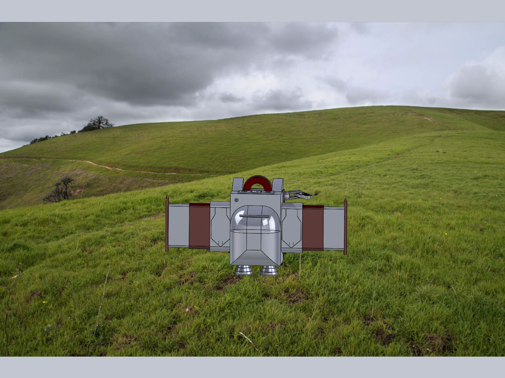
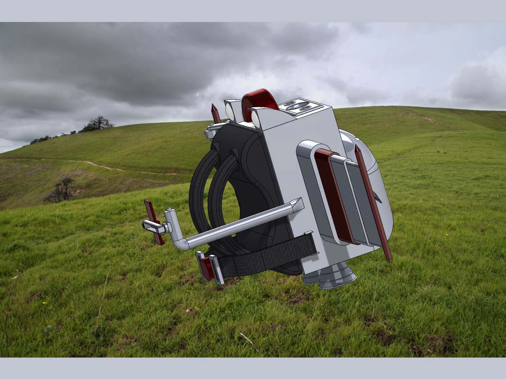
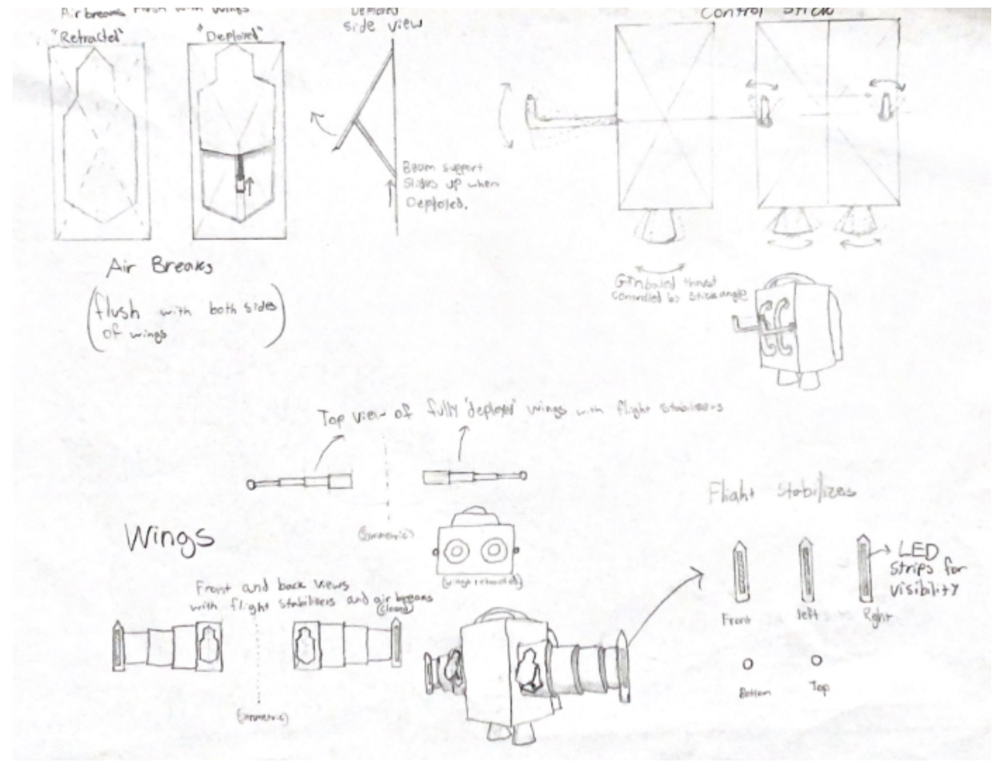

# Wearable Jetpack Concept

A personal flight device that folds down into a backpack you could carry around. My 4 person team
designed the whole thing in SolidWorks, from the folding wings to the harness. I led the design of
the wings, the airbrakes and the control stick.

Folded up and worn as a backpack:

## The idea

- Most personal flight concepts are impossible to carry when you're not flying
- This one folds into something a person can wear on the way to work
- Wings, airbrakes and controls all stow inside the pack

## What I designed

- Folding wings: five segments per side that stack into the pack, sized so the shape still works
  when opened
- Airbrakes: a hinged arm and piston mechanism that sits flush with the wing surface when
  retracted and swings out to slow a descent
- Control stick: a handle mounted on the harness for steering during flight

## The rest of the assembly

- Harness with straps, a control pad and a load bearing frame
- Phone holder and microphone mount built into the body
- Over 16 custom parts across 5 subassemblies

## What was hard

Folding versus strength. Wings that fold need joints, and joints are where a wing wants to break.
Getting the segment interfaces right took the most iteration.

Fit across a team. With 16 parts and 4 people, parts only fit together because we agreed on a
shared file structure and kept every model driven by the same dimensions.

Software crashes. SolidWorks kept failing on the large assembly, so we started saving checkpoints
and rebuilt several parts from scratch.

## Deliverables

- Full part and assembly models
- Technical drawings with tolerance callouts
- Exploded views and a bill of materials
- Rendered animation of the wings deploying

## From the first sketches

## Tools

- SolidWorks 2023 for modeling, assembly, drawings and rendering

## Files

- `media/` renders, animation and the original SolidWorks drawings
- `Team Project Final Report - Group 10.pdf` full written report
- `presentation.pdf` final presentation

## Team

Nicholas Ueki, Sophia Aponte, Nafez Ahmmed, Pranav Devalapalli
